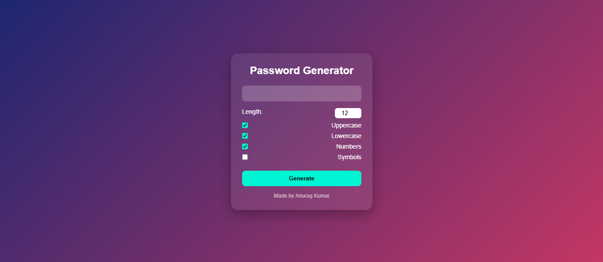
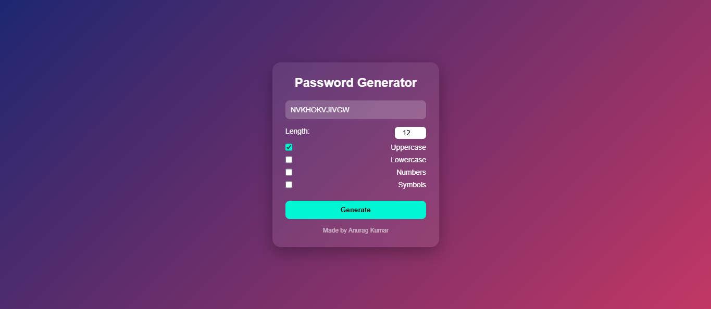

# Password Generator

A simple and efficient web application that generates secure passwords based on user preferences such as length and character types. It helps users create strong passwords to enhance security.

## Features
- Generate random secure passwords
- Customize password length
- Include/exclude:
  - Uppercase letters
  - Lowercase letters
  - Numbers
  - Symbols
- One-click password generation
- Clean and responsive UI

## Tech Stack
- HTML
- CSS
- JavaScript

## How to Run
1. Clone the repository
2. Open `index.html` in your browser

## Future Improvements
- Add password strength indicator
- Add copy-to-clipboard button
- Save generated passwords (optional)

## Screenshot

